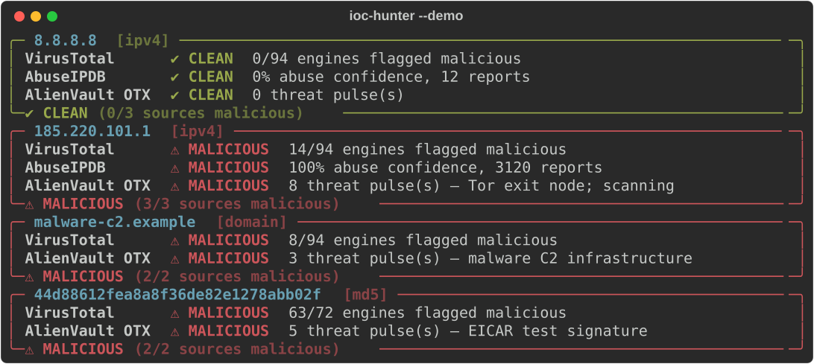

# 🛡️ IOC Hunter

> A threat-intelligence enrichment CLI for SOC analysts — check IPs, domains, URLs and file hashes against **VirusTotal**, **AbuseIPDB** and **AlienVault OTX**, then get one unified verdict.

Built to speed up the daily SOC L1 task of triaging indicators of compromise (IOCs): instead of opening three portals per artifact, run one command and get a consolidated, colour-coded verdict — with JSON and HTML output for tickets and automation.



---

## ✨ Features

- **Auto-detects IOC type** — IPv4/IPv6, domain, URL, and MD5/SHA1/SHA256 hashes.
- **Three sources in one query** — VirusTotal, AbuseIPDB (IP), AlienVault OTX.
- **Unified verdict** — aggregates the worst finding into `CLEAN / SUSPICIOUS / MALICIOUS`.
- **Defang-aware** — accepts `hxxps://evil[.]com` style indicators straight from tickets.
- **Multiple outputs** — rich console, compact summary table, JSON (for SOAR/scripts), and a standalone HTML report.
- **Batch input** — pass IOCs as arguments, from a file (`-f`), or via stdin (pipe).
- **Automation-friendly** — exits `1` when anything malicious is found.
- **Offline demo mode** — `--demo` needs no API keys, great for trying it out.

## 🚀 Installation

```bash
git clone https://github.com/defamp/ioc-hunter.git
cd ioc-hunter
pip install -r requirements.txt
# optional: install as a global `ioc-hunter` command
pip install -e .
```

Requires Python 3.8+.

## 🔑 Configuration

Copy the example env file and add your **free** API keys:

```bash
cp .env.example .env
```

```ini
VT_API_KEY=your_virustotal_key
ABUSEIPDB_API_KEY=your_abuseipdb_key
OTX_API_KEY=your_otx_key
```

| Provider | Get a free key |
|----------|----------------|
| VirusTotal | https://www.virustotal.com/gui/my-apikey |
| AbuseIPDB | https://www.abuseipdb.com/account/api |
| AlienVault OTX | https://otx.alienvault.com/api |

> `.env` is git-ignored — your keys never get committed. Providers without a key are skipped gracefully.

## 📖 Usage

```bash
# Try it with no keys at all:
python -m ioc_hunter --demo 8.8.8.8 185.220.101.1 evil.com

# Real lookups (after setting keys):
ioc-hunter 1.2.3.4 malware.example d41d8cd98f00b204e9800998ecf8427e

# From a file, compact table:
ioc-hunter -f samples/iocs.txt --summary

# Pipe from another tool:
cat iocs.txt | ioc-hunter --summary

# Machine-readable output:
ioc-hunter --json 1.2.3.4 > result.json
ioc-hunter --html report.html -f samples/iocs.txt

# Only use specific providers:
ioc-hunter --providers virustotal,otx malware.example
```

### Options

| Flag | Description |
|------|-------------|
| `-f, --file PATH` | Read indicators from a file (one per line; `#` starts a comment at line start or after whitespace, so URL fragments like `…/login#token` are kept) |
| `--providers LIST` | Comma-separated subset: `virustotal,abuseipdb,otx` |
| `--demo` | Offline demo mode (canned data, no API keys) |
| `--allow-internal` | Also send private IPs and internal hostnames to the providers (off by default) |
| `--summary` | Compact one-row-per-IOC table |
| `--json` | JSON to stdout (redirect to save) |
| `--html PATH` | Write a standalone HTML report |
| `--no-color` | Disable coloured output |

## 🔒 Internal indicators stay internal

Every lookup sends the indicator to a third party (and VirusTotal lookups can be
visible to other users of the platform). By default IOC Hunter therefore **does
not query** indicators that only make sense inside your network:

- non-global IPs: RFC 1918, loopback, link-local, CGNAT (100.64/10), unique-local IPv6, …
- internal hostnames: `.local`, `.localhost`, `.localdomain`, `.internal`,
  `.intranet`, `.corp`, `.lan`, `.home`, `.home.arpa`, `.private`
- URLs whose host is one of the above

They still appear in the output with a `not queried: …` note. Pass
`--allow-internal` if you really want them sent. Hashes are always queried —
they can't be classified as internal.

## 🧠 How the verdict works

Each provider maps its raw data to a normalised verdict, and the indicator's overall verdict is the **worst** across providers:

| Provider | MALICIOUS when | SUSPICIOUS when |
|----------|----------------|-----------------|
| VirusTotal | ≥ 3 engines flag it | ≥ 1 malicious / suspicious |
| AbuseIPDB | abuse confidence ≥ 50% | any reports |
| AlienVault OTX | ≥ 3 threat pulses | ≥ 1 pulse |

## 🗂️ Project structure

```
ioc_hunter/
├── cli.py            # argparse entry point
├── enrich.py         # orchestrator + provider registry
├── models.py         # IOCType, Verdict, dataclasses
├── utils.py          # IOC detection + defanging
├── report.py         # console / JSON / HTML rendering
└── providers/
    ├── base.py       # shared provider logic + error handling
    ├── virustotal.py
    ├── abuseipdb.py
    ├── otx.py
    └── demo.py       # offline canned provider
tests/                # offline unit tests (pytest)
```

## 🧪 Tests

```bash
pip install pytest
pytest -q
```

All tests are offline (no network / API keys required): provider calls run against a mocked HTTP layer. CI runs them on Python 3.8–3.13.

## ⚠️ Disclaimer

For **defensive / authorised** security operations only. Respect each provider's API terms and rate limits. Sample malicious indicators in this repo (e.g. the EICAR test hash) are safe, well-known test artifacts.

## 📄 License

MIT © Defa Mulya Pratama
